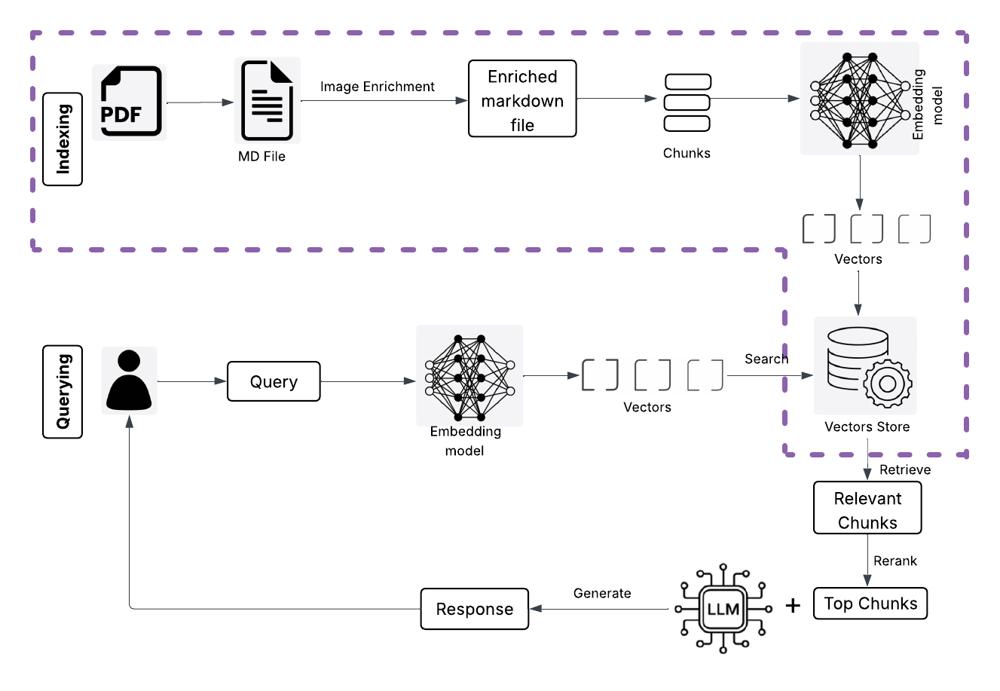

# Multimodal RAG

A multimodal Retrieval-Augmented Generation (RAG) system for chatting with **PDF, DOCX, and TXT documents** — handling **text, tables, images, and scanned files**.

---

## Overview

Most RAG systems fail on real-world documents:
- multi-column text gets mixed  
- tables lose structure  
- figures are ignored  
- scanned PDFs return no text  

This system solves it using a **markdown-first pipeline with content-aware chunking**, enabling unified retrieval across text, tables, and images.

**Pipeline:**
1. Document is converted into structured markdown (Docling)  
2. Images are extracted and enriched with descriptions (Gemini)  
3. Content-aware chunking is applied (text, tables, images)  
4. Data is indexed using embeddings and keyword search  
5. Retrieval combines semantic and keyword search with reranking  
6. Answer is generated strictly from retrieved context  

---

## Demo

> _Coming soon_

---

## Key Features

- **Multimodal document understanding**  
  Works with text, tables, and images together  

- **Multi-column handling**  
  Preserves correct reading order during parsing  

- **Markdown-first pipeline**  
  Entire document converted into structured markdown  

- **Content-aware chunking**  
  Chunking strategy adapts based on content type  

- **Figure understanding**  
  Images converted into searchable descriptions  

- **Hybrid retrieval**  
  Combines keyword search and semantic search  

- **Reranking**  
  Improves relevance of retrieved results  

- **Cross-reference handling**  
  References like *“Figure 3”* or *“Table IV”* directly retrieve the correct content  

- **Scanned PDF support**  
  OCR automatically enabled when needed  

- **Relevance gate**  
  Prevents hallucination by skipping answer generation if nothing relevant is found  

---

## Problem Statement

Standard RAG systems work well for plain text, but real-world documents include:
- multi-column layouts  
- structured tables  
- figures and charts  
- scanned content  

Naive extraction breaks structure and reduces retrieval quality.  

This system preserves structure before embedding, improving retrieval accuracy.

---

## Architecture Diagram

> 

---

## System Design

### 1. Document Ingestion
- Accepts PDF, DOCX, TXT  
- Detects scanned PDFs and enables OCR  
- Supports multiple files per session  

---

### 2. Parsing and Markdown Conversion
- Docling converts documents into structured markdown  
- Maintains correct reading order  
- Tables stored in pipe (`|`) format  
- Images replaced with placeholders in markdown  
- Actual images saved separately in a folder  

---

### 3. Image Enrichment
- Extracted images are read from the image folder  
- Sent to Gemini for detailed descriptions  
- Extracts values, labels, and insights  
- Descriptions are written back into markdown  

---

### 4. Intermediate Representation
- One markdown file per document  
- Contains all extracted and enriched content  
- Serves as the base for chunking and retrieval  

---

### 5. Chunking (Content-Aware)

- **Text**
  - Split into chunks with overlap  

- **Tables**
  - Never split mid-row  
  - Large tables split with header repeated  

- **Images**
  - Each image becomes a chunk  
  - Includes description and reference metadata  

---

### 6. Indexing
- Dense embeddings stored in ChromaDB  
- Keyword index created using BM25  

---

### 7. Retrieval
- Query normalization handles variations (e.g., Figure III vs Figure 3)  
- Keyword search (BM25) and semantic search retrieve relevant chunks  
- Reciprocal Rank Fusion (RRF) combines results from keyword and semantic search into a single improved ranking 
- Cross-reference resolution fetches exact tables/images when explicitly mentioned  
- Reranking selects the most relevant final results  

---

### 8. Answer Generation
- Only retrieved chunks are used as context  
- No external knowledge is allowed  
- If nothing relevant is found, system returns “not found”  
- Follow-up queries are rewritten before retrieval  

---

## Tech Stack

| Layer | Tool |
|---|---|
| **Input** | PDF · DOCX · TXT (text, tables, images) |
| **UI** | Streamlit |
| **Document Parser** | Docling · DocLayNet |
| **OCR** | Tesseract · auto-enabled for scanned PDFs |
| **Image Understanding** | Gemini 2.5 Flash |
| **Intermediate Format** | Enriched Markdown |
| **Embedding** | BAAI/bge-base-en-v1.5 · local CPU |
| **Vector Store** | ChromaDB |
| **Keyword Search** | BM25Retriever |
| **Reranker** | BAAI/bge-reranker-base · local CPU |
| **Question Rewriter** | Groq · Llama-3.1-8b-instant |
| **Answer LLM** | Groq · Llama-3.3-70b-versatile |

 > All ML models run locally on CPU - no GPU required.

---

## Getting Started


**1. Clone**
```bash
git clone https://github.com/charunethra/advanced-rag
cd advanced-rag
```
 
**2. Install**
```bash
pip install -r requirements.txt
```
 
**3. Add API keys**
```env
# create an .env file and add the following
GROQ_API_KEY=your_key
GEMINI_API_KEY=your_key
```
Free tier — [Groq](https://console.groq.com) · [Gemini](https://aistudio.google.com)
 
**4. Run**
```bash
streamlit run app.py
```
---
 
*Built by [Charu Nethra Sekar](https://www.linkedin.com/in/charunethrasekar/)*
